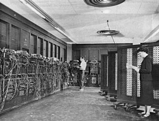
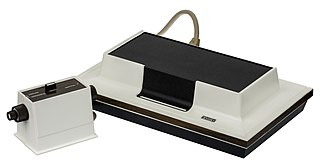

- How many layers are in the TCP/IP (OSI Model) protocol?
  - 10 layers
  - 4 layers
  - 5 layers
  - ***7 layers***

- Who is the creator of PHP?
  - Jack Sparrow
  - ***Rasmus Lerdorf***
  - Tim Berners-Lee
  - Dennis Ritchie

- When was MS-DOS released?
  - 1991
  - 1985
  - ***1981***
  - 1980

- When was the first electronic, Turing-complete device created?
  - 2000
  - 1945
  - 1955
  - ***1943***

The Colossus set of computers were produced from 1943 to 1945.

- When was the first implementation of Blockchain Technology?
  - ***2009***
  - 2008
  - 2000
  - 1991

Blockchain concept was implemented as a core component of Bitcoin in 2009.

- Who invented the first version of the SSH protocol?
  - ***Tatu Ylonen***
  - Abhay Bhushan
  - Ted Nelson
  - Marc Crispin

- Who created the Blu-ray standard?
  - HP
  - ***Sony***
  - IBM
  - Apple

- Which OS has to be used with openVZ?
  - Linux / macOS / Windows
  - ***Linux***
  - macOS
  - Windows

- Is DisplayPort able to carry audio?
  - ***Yes but it depends on design***
  - Yes but it needs an adaptor
  - Yes
  - No

- What is FQDN?
  - Fully Qualified Domain hostName
  - ***Fully Qualified Domain Name***
  - Fully Qualified Defense Name
  - Fully Qualified Data Name

- What was the first laptop released?
  - Epson HX-20
  - ***Osborne 1***
  - Macintosh Portable
  - Bondwell 2

The Osborne 1 was the first commercially successful portable microcomputer, released on April 3, 1981, by Osborne Computer Corporation.

- What is the advantage of thin client?
  - A large internet storage capacity
  - It doesn't need internet to work
  - ***Lower Operation Costs***
  - It doesn't need a monitor

A thin client is basically a potato computer connected remotely to a NASA server. Kinda like Shadow.

- What was the weight of the computer ENIAC?
  - 300kg
  - 1.5t
  - ***30t***
  - 150kg

- When was born Alan Turing?
  - ***1912***
  - 1981
  - 1934
  - 1891

- Do you need a multiprocessor computer to have a virtual machine?
  - ***No***
  - Yes
  - Maybe
  - I don't know

- What logo is used to represent NetBSD?
  - ***A flag***
  - A fish
  - A square
  - A dragonfly

- What is the purpose of the Free Software Foundation?
  - Protect and promote the software's privacy
  - Protect and promote the freedom to get any software for free
  - Provide private softwares to other companies
  - ***Protect and promote the freedom to study, distribute, create, modify computer software***

- What is the maximum partition size for NTFS?
  - 8TiB
  - ***256TiB***
  - 32TiB
  - 1EiB

- In which year was the first Playstation made?
  - ***1994***
  - 1992
  - 1990
  - 1995

December 3, 1994.

- Which type of DNS entry are correct ?
  - OVH entry / Verisign entry
  - ***A / AAAA / MX / PTR***
  - Big entry / Small entry
  - BTP / ECS / DNSA / AVG

- What is the OpenBSD mascot?
  - ***Puffy***
  - Android
  - Tux
  - DeamonBSD

- Which one of the following sentences about SDRAM is true?
  - It cannot replace the standard RAM
  - It improves the memory clock speed to 200 MHz
  - It is asynchronous
  - ***It is coordinated with an externally supplied clock signal***

- What is the meaning of TCP?
  - Transit Control Protocol
  - Transmission Check Protocol
  - ***Transmission Control Protocol***
  - Tranformation Control Protocol

- What is the standard port for the wake-on-lan service?
  - 6667
  - 80
  - 20
  - ***9***

- What is VoIP?
  - Vocal over Internet Protocol
  - ***Voice over Internet Protocol***
  - Voice over Internet Piracy
  - Voice on Internet Protocol

- What does SSH mean?
  - ***Secure SHell***
  - Secure Shell Host
  - System Service High
  - Super Sayian Heaven

- What does HDMI mean?
  - ***High-Definition Multimedia Interface***
  - High-Defined Multiplatforme Integrer
  - High-Definition Multiplatforme Interface
  - High-Definition Multimedia Interaction

- What was the name of the first electronic, Turing-complete device created?
  - Mac Book Pro
  - ENIAC
  - ***Colossus***
  - LISA 1

- When was the first USB flash drive invented?
  - ***2000***
  - 1998
  - 1994
  - 1988

- What does VGA mean?
  - Video Game Analog
  - ***Video Graphics Array***
  - Visual Graphics Adaptor
  - Virtual Graphics Accelerator

- Who is the founder of the Free Software Foundation?
  - Bjarne Stroustrup
  - Brendan Eich
  - Linus Torvalds
  - ***Richard Stallman***

- What protocol is used to resolve IP adress host name?
  - ***DNS***
  - IP
  - FTP
  - DHCP

- What is the name of the first game console?
  - Atari 2600
  - ***Odyssey***
  - Xbox
  - PS1

- What was the first smartphone to be sold?
  - ***IBM Simon***
  - Windows phone 465
  - Nokia 3310
  - iPhone

- What was the first Windows to have Internet Explorer?
  - ***Windows 95***
  - Windows XP
  - Fedora
  - Windows 98

- When was the first message on the Internet sent?
  - 1976
  - 1973
  - 1964
  - ***1969*** :eyes:

- Which paradigm describes what the code does step by step?
  - ***Imperative***
  - Object-Oriented
  - Subjunctive
  - Logical
